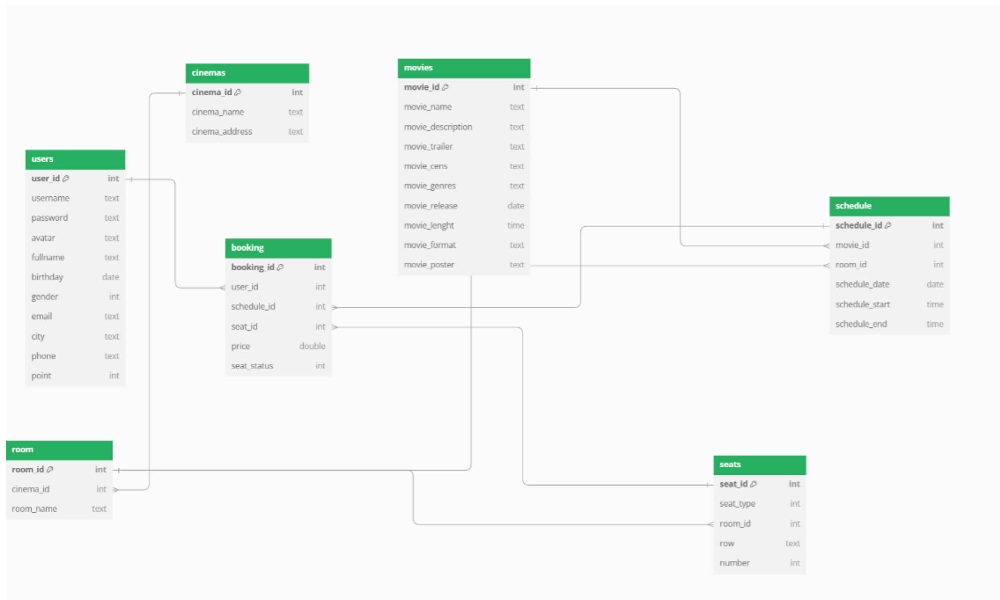
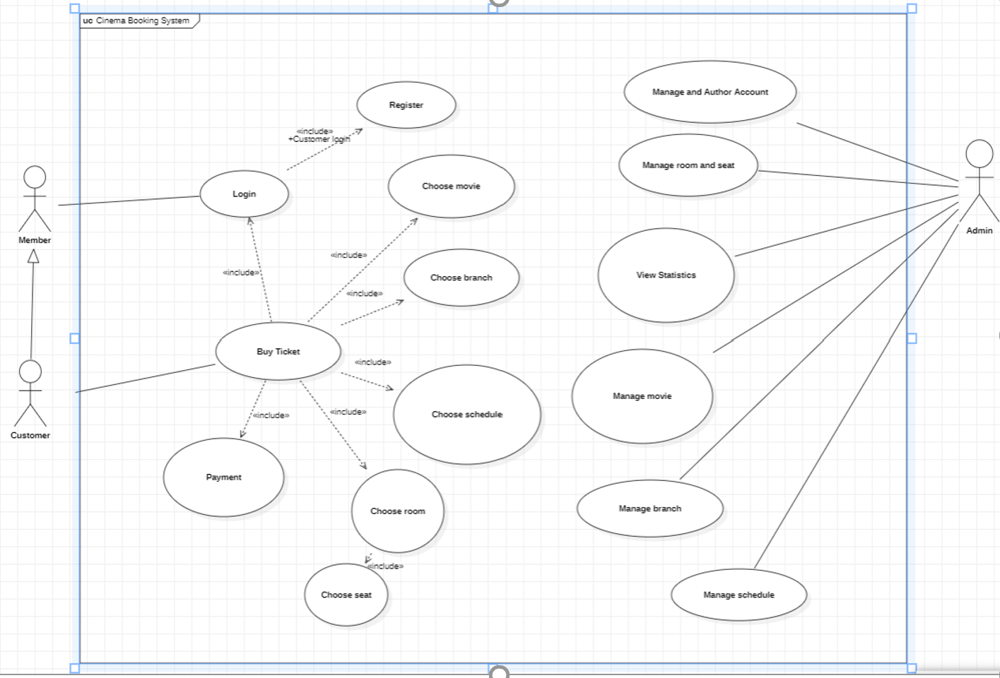
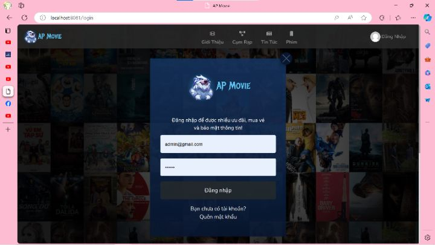
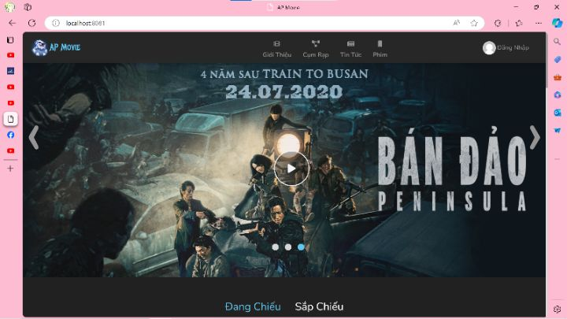
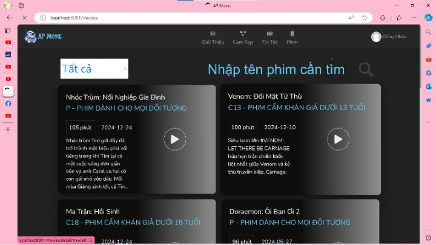
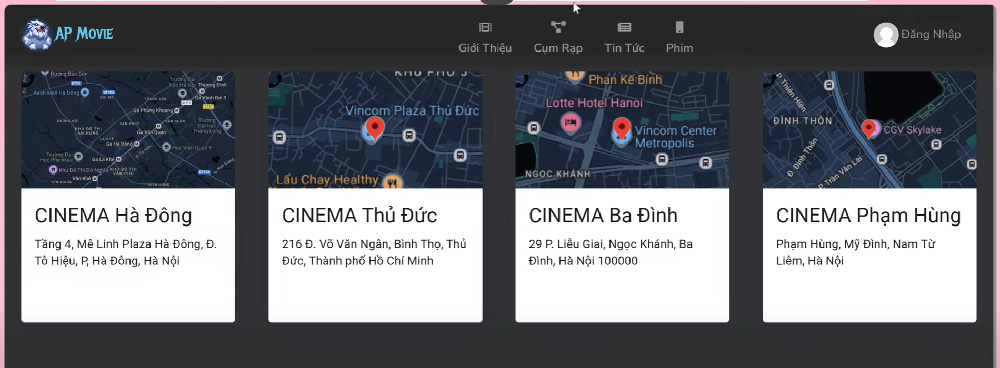
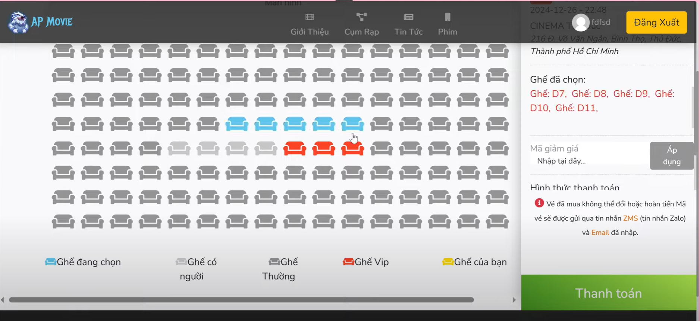
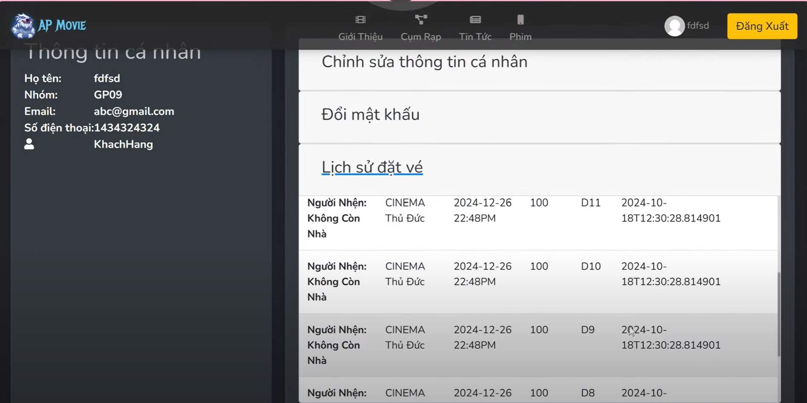
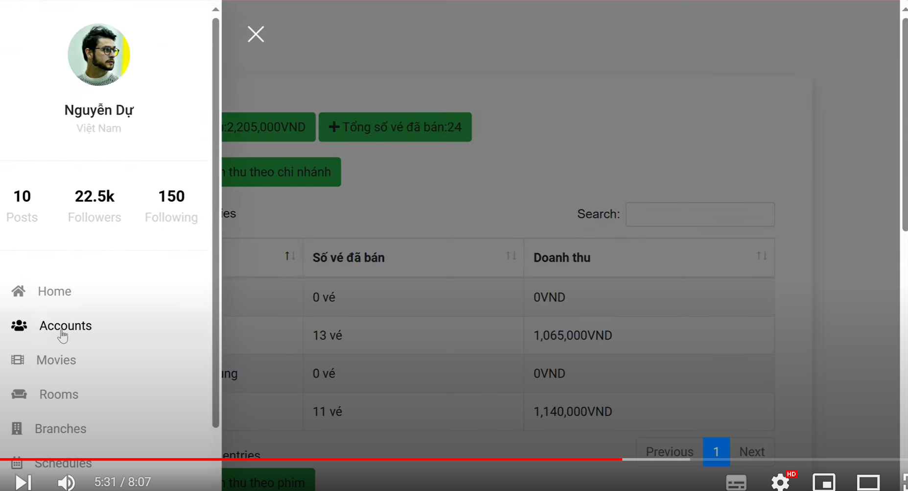

# OOP_1_1_24_N02_Group5
Dự án quản lý web xem phim  
Dự án quản lý web xem phim cho phép người dùng đặt vé, quản lý phòng chiếu, và cung cấp các dịch vụ   
liên quan đến đặt vé cho rạp chiếu phim.  
Để khởi chạy dự án:  
-tại project cinema_back_end-master  
-run file CinemaBackEndApplication.java (chạy API phía backend)  
-tại project cinema_client  
-run file CinemaClientApplication.java (chạy giao diện phía client)  
Các công nghệ, framework, hoặc thư viện được sử dụng trong dự án:  
-Java Spring Boot  
-MySQL  
Thông tin liên hệ của nhóm phát triển  
-22010286@st.phenikaa-uni.edu.vn  
-22012277@st.phenikaa-uni.edu.vn  

## Lưu đồ thuật toán  
Class diagram  
  

Use case diagram  
  

login  
  

home  
   

movie  
  

branch  
  

branch  
  

schedule  
  

admin  

